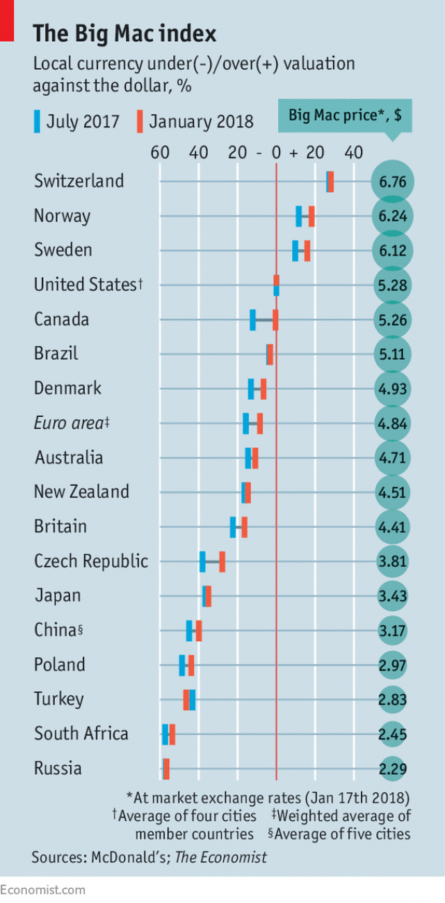

```{r load-packages, message=FALSE}
library(tidyverse)
```

## Background

The *[Economist](https://www.economist.com/)* has a quick visualization of currency exchange rates based on "purchasing power parity." The visualization is based on just one item: the [Big Mac](https://www.mcdonalds.com/us/en-us/product/big-mac.html) sandwich at McDonalds. The index is therefore called the Big Mac index, and is described [here](https://www.economist.com/news/2018/07/11/the-big-mac-index). Figure 1 shows an example of  how *The Economist* presents the data, from WE WILL PUT A REFERENCE HERE.

```{r economist-graphic, echo = FALSE, fig.cap = "Figure 1: *The Economist*'s presentation of the Big Mac Index" }

```


Data behind the Big Mac Index is published [here on GitHub](https://github.com/TheEconomist/big-mac-data). For convenience, it's available in `data/big-mac-index.csv`.

```{r load-data, message=FALSE, warning=FALSE}
Big_mac <- read_csv("../data/big-mac-index.csv")
```

Year is `r params$year` and the countries are `r paste(params$countries, collapse = ", ")`


## Showing the data

Let's look at year 2018 and just the basic  variables

```{r select-year}
Mac_2018 <- Big_mac %>%
  filter(lubridate::year(date) == params$year) %>%
  select(date, name, local_price, dollar_ex, dollar_price)
```

Below is some standard table output:

```{r standard-table}
Mac_2018 %>%
  arrange(desc(dollar_price))
```

And the same output with `kable`:

```{r kable}
Mac_2018 %>%
  arrange(desc(dollar_price)) %>%
  knitr::kable()
```

Another useful package is `DT`, especially for displaying tables of with large number of rows:

```{r datatable}
Mac_2018 %>% 
  DT::datatable(editable = TRUE)
```

